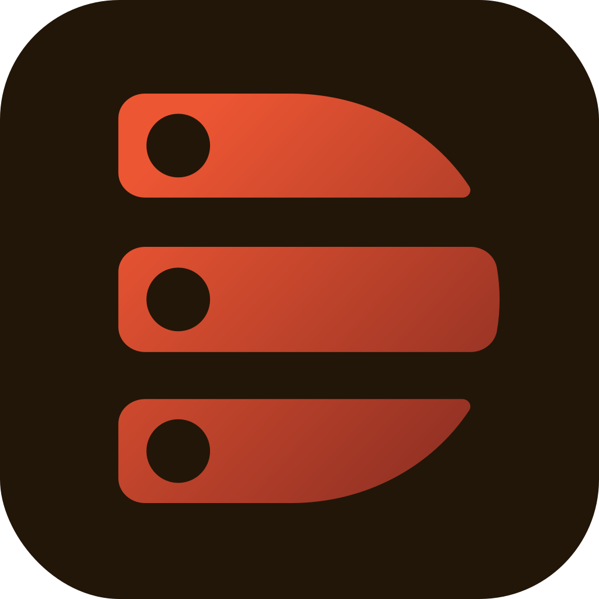

<p align="center">
  
</p>

# HANA Portfolio [Frontend Services]

A modern and responsive my personal portfolio built with Next.js, TypeScript, HeroUI and Tailwind CSS.

### Live Preview -> [HANA Portfolio](https://portfolio.hana-ci.com/dickyherlambang)

## Features

- API-driven content
- Contact form integration
- Dark themed interface
- Dynamic experience and projects section
- Responsive modern UI
- Smooth animations and transitions

## Tech Stack

- Next.js
- Tailwind CSS
- HeroUI / NextUI
- TypeScript
- Jest
- REST API
- PostgreSQL
- Cloudflare Turnstile

## How to run (Docker)

- Clone the repository:

-- Frontend package (Next JS)

```bash
git clone https://github.com/Nicklas373/hana-portfolio.git hana-portfolio-fe
```

-- Backend package (Express JS)

```bash
git clone https://github.com/Nicklas373/hana-portfolio-be.git hana-portfolio-be
```

- Move into the project directory:

-- Frontend Backend

```bash
cd hana-portfolio-fe
```

-- Backend Backend

```bash
cd hana-portfolio-be
```

- Initiate docker compose (Make sure on root directory from this project):
  -- Applicable for frontend and backend

```bash
docker compose up -d
```

- Make sure to create Cloudflare Turnstile Widget first -> Look here for [documentation](https://developers.cloudflare.com/turnstile/)
- Check on http://portfolio-sit.localhost

## Project Structure

```bash
src/
 ├── app/
 ├── components/
 ├── hook/
 ├── lib/
 └── variables/
```

## Deployment

This project can be deployed using:

- Vercel
- Docker
- Nginx Reverse Proxy
- Traefik

## Contact

Feel free to connect with me:

- [LinkedIn](https://linkedin.com/in/dicky-herlambang-b8247813a)
- [GitHub](https://github.com/Nicklas373)
- [Email](mailto:herlambangdicky5@gmail.com)

---

# HANA-CI Build Project 2016 - 2026
